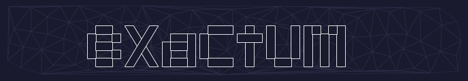
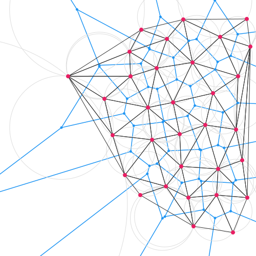
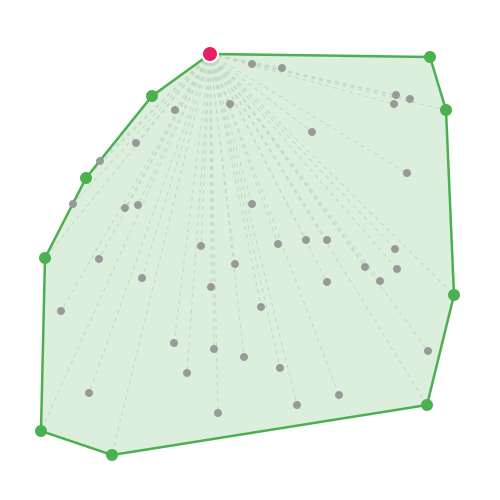
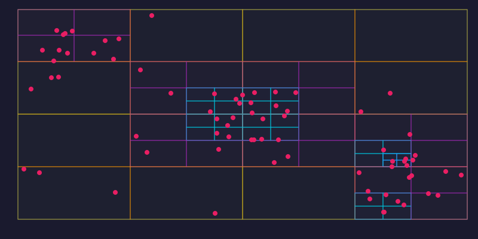
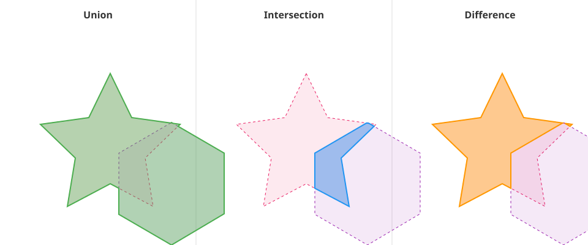
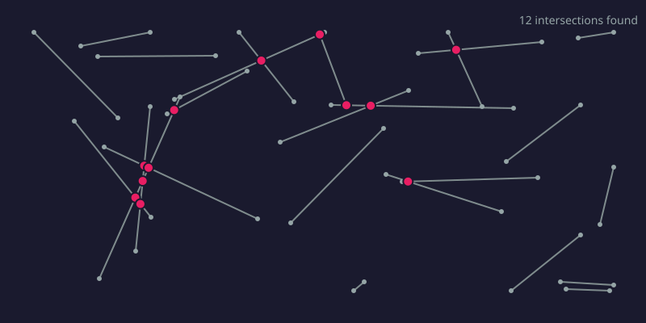

[](https://github.com/timthirion/exactum/actions/workflows/ci.yml)

*"God created the integers; all else is the work of man."* - Leopold Kronecker

Exact computational geometry in Rust. No floating-point. No approximations.

## Installation

```bash
cargo add exactum
```

## Quick Example

```rust
use exactum::{Point2, algo::{delaunay, graham_scan}};

// Create some points
let points = vec![
    Point2::new(0_i64, 0),
    Point2::new(10, 0),
    Point2::new(5, 8),
    Point2::new(5, 3),
];

// Convex hull
let hull = graham_scan(&points);
assert_eq!(hull.len(), 3); // Triangle

// Delaunay triangulation
let tri = delaunay(&points).unwrap();
assert_eq!(tri.triangles.len(), 2); // Two triangles

// Point location in O(log n)
let inside = tri.locate(Point2::new(5, 2));
assert!(inside.is_some());
```

## Features

**Core Primitives**
- `Point2<T>`, `Point3<T>` - Generic over `i32`, `i64`, `i128`
- `Vector2<T>`, `Vector3<T>` - Displacement vectors
- `Rational` - Exact rational numbers for intersection points

**Geometric Predicates**
- `orient2d`, `orient3d` - Orientation tests
- `incircle`, `insphere` - Circumcircle/sphere tests
- `collinear`, `coplanar` - Degeneracy tests

**Algorithms**
- Convex hull (Graham scan)
- Delaunay triangulation (Bowyer-Watson)
- Voronoi diagrams
- Boolean polygon operations (union, intersection, difference)
- Segment intersections (Bentley-Ottmann sweep)

**Spatial Data Structures**
- `KdTree2`, `KdTree3` - K-d trees
- `Quadtree`, `Octree` - Adaptive spatial partitioning
- `RTree` - Bounding box indexing

**Operations**
- Segment/ray/line intersections
- Point-in-polygon, point-in-triangle
- Distance, area, centroid

## Gallery

### Delaunay Triangulation & Voronoi Diagram



### Convex Hull



### Quadtree Spatial Indexing



### Boolean Polygon Operations



### Sweep Line Segment Intersections



## Minimum Supported Rust Version

Rust 1.70 or later.

## License

Apache-2.0
